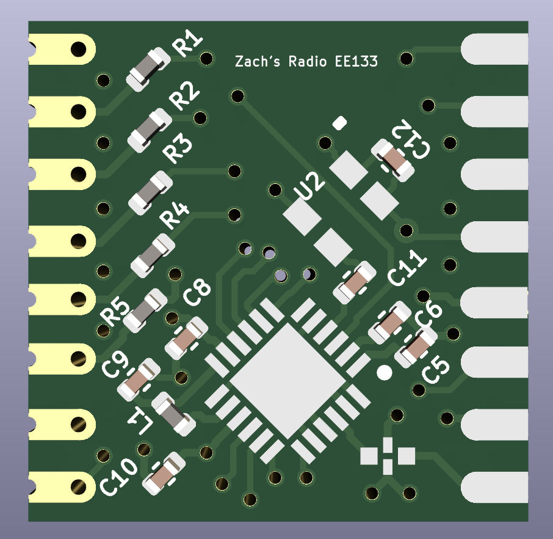

# RadioPCB

Based on project done by Max Holliday https://github.com/maholli/sx1280-breakout,
breakout board for Semtech SX1280 LoRa radio compatible with RFM9x footprints.

## [Schematic for breakout board](Schematic_sx1280.pdf)

  

